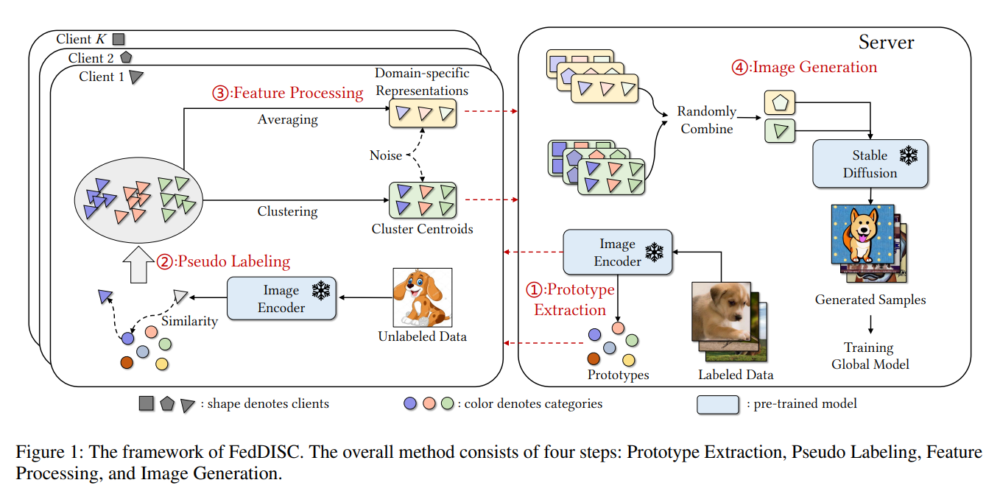
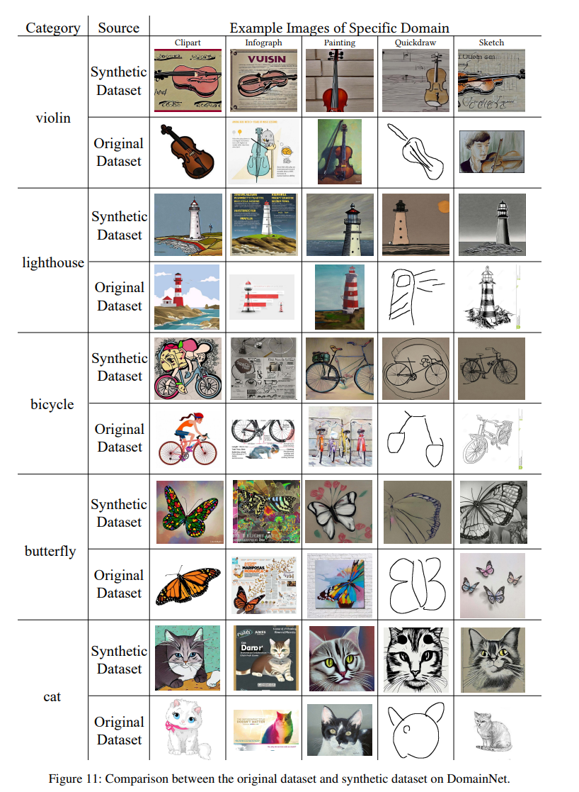
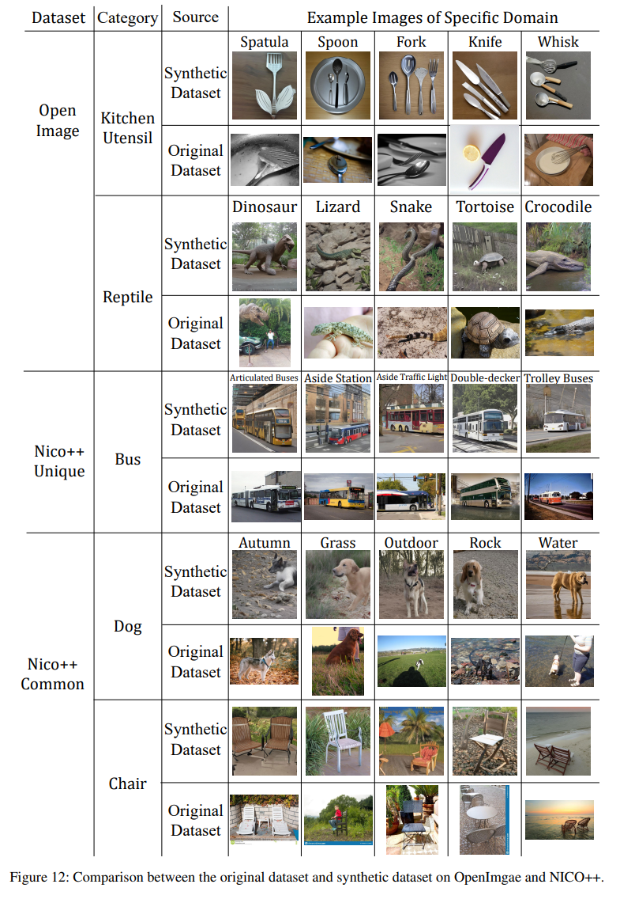
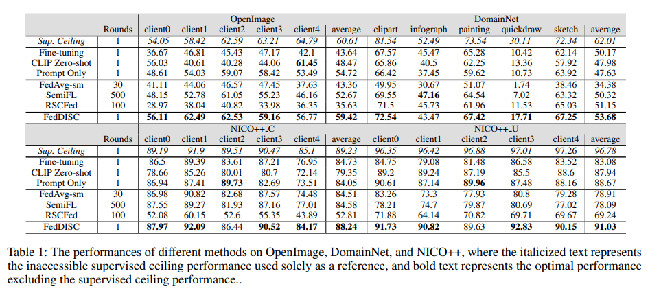

## FedDISC

This repository is the implementation of FedDISC (Federated Diffusion-Inspired Semi-supervised Co-training). 

FedDISC is a semi-supervised federated learning method that leverages pre-trained diffusion models on the server. Its goal is to generate synthetic images that comply with each client's distribution by uploading partial client representations.

With the vast knowledge within the pre-trained diffusion models, it becomes possible to generate samples with both more diversity and quality than the original client data, with the great possibility of surpassing the ceiling performance of centralized training.

## Requirements

	pip install -r requriements.txt

## Generate Images & Fine-tune & Test

	sh ./generate_test.sh

## Pre-trained Diffusion Model

The pre-trained diffusion model primarily used in our method is [Stable Diffusion v2-1-unclip](https://huggingface.co/stabilityai/stable-diffusion-2-1-unclip).

## Visualization Experiments

Below, we present a comparison between the synthetic dataset and the original client data. It can be observed that, except for the quickdraw domain in the DomainNet dataset, which is exceptionally unique, FedDISC performs very well in generating data on the server that complys with the client's distribution.

Thanks to these high-quality synthetic data, our method has also achieved great performance exceeding the ceiling performance of centralized training in some cases during quantitation experiments.

# BibTex

	@misc{yang2023exploring,
	      title={Exploring One-shot Semi-supervised Federated Learning with A Pre-trained Diffusion Model}, 
	      author={Mingzhao Yang and Shangchao Su and Bin Li and Xiangyang Xue},
	      year={2023},
	      eprint={2305.04063},
	      archivePrefix={arXiv},
	      primaryClass={cs.CV}
	}

[Arxiv Link](https://arxiv.org/abs/2305.04063)